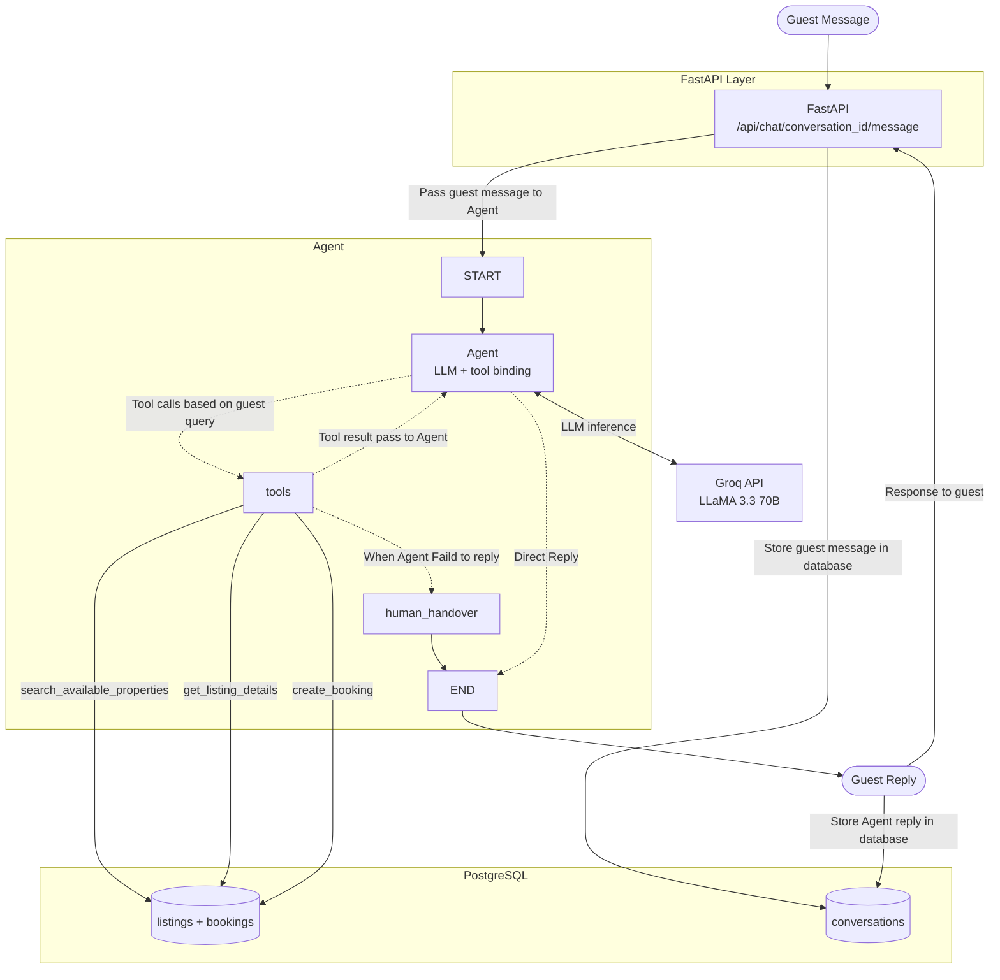

# StayEase AI Booking Agent

A LangGraph-powered conversational AI agent for StayEase — a short-term accommodation rental platform in Bangladesh. Guests interact with the agent via chat to search for properties, view listing details, and make bookings in real time.

---

## 1.1 System Overview
The system exposes a FastAPI backend that receives guest messages over HTTP. Each message is passed to a LangGraph agent, which uses a Groq-hosted LLM (LLaMA 3.3 70B) to understand guest intent and invoke the appropriate tool — search, details, or book. If the guest asks about anything outside these three capabilities, the agent escalates to a human support agent through a dedicated human handover tool. Conversation state is persisted using a PostgreSQL-backed LangGraph checkpointer, ensuring full context retention across sessions.



## 1.2 Conversation Flow

**Guest says:** `"I need a room in Cox's Bazar for 2 nights for 2 guests"`

| Step | What Happens |
|------|-------------|
| 1 | Guest message arrives at `POST /api/chat/{conversation_id}/message` |
| 2 | FastAPI invokes the LangGraph agent with `thread_id=conversation_id`. |
| 3 | The `agent` node calls the LLM with the message history + system prompt |
| 4 | The LLM recognises a search intent but notices check-in and check-out dates are missing. It replies: `"Sure! What dates are you planning to check in and check out?"` |
| 5 | The checkpointer saves the current state snapshot. FastAPI returns the reply to the guest |
| 6 | Guest replies: `"Check in May 1, check out May 3"` |
| 7 | FastAPI invokes the agent again with the same `thread_id`. The checkpointer restores the previous state — the LLM now has the full context of step 4 |
| 8 | The LLM now has all required fields. It calls `search_available_properties(location="Cox's Bazar", check_in="2026-05-01", check_out="2026-05-03", num_guests=2)` |
| 9 | ToolNode executes the tool — queries PostgreSQL for listings in Cox's Bazar that are not booked for those dates and can host ≥ 2 guests |
| 10 | Tool returns a list of available properties with prices in BDT. The LLM formats the results: `"I found 2 properties in Cox's Bazar for May 1–3 (2 nights): 1. Sea Pearl Beach Resort — ৳4,500/night 2. Coral View Guesthouse — ৳2,800/night. Would you like details on either?"` |
| 11 | The checkpointer saves the state. FastAPI returns the reply to the guest |
| 12 | Guest replies: `OK, book number 1.` |
| 13 | FastAPI invokes the agent again with the same `thread_id`. The checkpointer restores the previous state |
| 14 | The LLM recognises a booking intent and knows `listing_id="listing_001"` (Sea Pearl) from the previous state. It asks for missing guest details: `"Great choice! May I have your name and phone number to confirm the booking?"` |
| 15 | Guest replies: `"Rahim Uddin, 017******67"` |
| 16 | FastAPI invokes the agent again with the same `hread_id`. The checkpointer restores the full state. |
| 17 | The LLM now has all required fields. It calls `create_booking(listing_id="listing_001", guest_name="Rahim Uddin", guest_phone="01711234567", check_in="2026-05-01", check_out="2026-05-03", num_guests=2)` |
| 18 | ToolNode executes the tool — inserts a new record into the bookings table with status confirmed and calculates total price (2 nights × ৳4,500 = ৳9,000). Tool returns the booking confirmation with a `unique reference ID` |
| 19 | The LLM formats the result: `"✅ Booking confirmed! Reference: BKG-20260501-042. Sea Pearl Beach Resort, May 1–3, 2 guests. Total: ৳9,000. We look forward to your stay!"` |
| 20 | The checkpointer saves the final state. FastAPI returns the confirmation to the guest |

---

## 1.3 LangGraph State Design

```python
class InputState(TypedDict):
    """
    Input state received from the API layer.

    This state represents the raw input from the guest.

    Fields
    ------
    messages : List of conversation messages(BaseMessage) from the guest, Agent and tools.
               This typically includes the latest user query and any prior context
               passed from the client. Messages are incrementally appended using
               the `add_messages` reducer during graph execution.
    """
    messages: Annotated[List[BaseMessage], add_messages]


class AgentState(InputState, total=False):
    """
    Internal working state shared across all nodes in the LangGraph execution.

    This state extends the InputState by including optional control flags and
    metadata used by the agent to manage flow, decision-making, and escalation.

    It evolves throughout the graph as nodes read and update fields.

    Fields
    ------
    messages : Full conversation history including user, assistant, and tool messages.
               Automatically accumulated via the `add_messages` reducer.

    is_human_needed : Boolean flag indicating whether the agent is unable to
                      confidently handle the request and requires human intervention.
                      Defaults to False if not set.

    human_handover_reason : Short explanation describing why the request is being
                            escalated to a human agent (e.g., ambiguity, unsupported
                            request, system limitation, or policy restriction).
                            Should only be set when `is_human_needed` is True.
    """

    is_human_needed: bool
    human_handover_reason: str


class OutputState(AgentState):
    """
    Final state returned to the API layer after graph execution completes.

    This state represents the resolved outcome of the agent's processing and is
    used to construct the API response.

    It typically includes:
    - The complete conversation history (including the final assistant response)
    - Any escalation signals for human handoff

    Notes
    -----
    This class currently mirrors AgentState but exists as a boundary layer.
    It allows future control over which fields are exposed externally without
    modifying the internal agent state structure.
    """
    pass
---
```

## 1.4 Node Design

| Node | What It Does | Updates in State | Next Node |
|------|-------------|-----------------|-----------|
| `agent` | Calls the LLM with full conversation history; LLM decides whether to invoke a tool or reply directly | `messages (appends LLM response with optional tool_calls)` | `tools` / `END` |
| `tools` | Executes the tool chosen by the LLM — search, details, booking, or human handover — and appends the result as a ToolMessage | `messages (appends ToolMessage), needs_human, human_handover_reason` | `agent` or `END` |
---

## 1.5 Tool Definitions

### `search_available_properties`

**When used:** Use this when the guest ask for available properties and provides a location, check-in date, check-out date, and number of guests. Queries the database to find properties in the given location that are not already booked for the requested dates and can accommodate the required number of guests.

**Input parameters:**
| Parameter | Type | Description |
|-----------|------|-------------|
| `location` | `str` | City or area e.g. `Mirpur` |
| `check_in` | `str` | Check-in date `YYYY-MM-DD` |
| `check_out` | `str` | Check-out date `YYYY-MM-DD` |
| `num_guests` | `int` | Number of guests (min 1) |

**Output format:**
```json
{
  "status": "success",
  "results": [
    {
      "listing_id": "ab16e731-6cee-424d-81a0-5929e9bdb0cc",
      "name": "Sea Pearl Beach Resort",
      "price_per_night": 4500,
      "currency": "BDT",
      "max_guests": 4,
      "description": "Beachfront room with ocean view, AC, free WiFi.",
      "rating": 4.7
    }
  ]
}
```

---

### `get_listing_details`

**When used:**
    - The guest asks for more information about a property they saw in search results
    - The guest asks about amenities, house rules, cancellation policy, or rating of a particular place
    - Example: "What are the amenities in the Seaside Villa?" or "Does that property allow pets?"

**Input parameters:**
| Parameter | Type | Description |
|-----------|------|-------------|
| `listing_id` | `UUID` | Unique ID of the property |

**Output format:**
```json
{
  "status": "success",
  "listing": {
    "listing_id": "ab16e731-6cee-424d-81a0-5929e9bdb0cc",
    "name": "Sea Pearl Beach Resort",
    "location": "Cox's Bazar",
    "price_per_night": 4500,
    "currency": "BDT",
    "max_guests": 4,
    "amenities": ["AC", "Free WiFi", "Hot Water", "Balcony", "TV"],
    "house_rules": "No smoking. Check-in after 2 PM. Check-out before 11 AM.",
    "cancellation_policy": "Free cancellation up to 48 hours before check-in.",
    "rating": 4.7,
    "total_reviews": 128
  }
}
```

---

### `create_booking`

**When used:** Guest explicitly confirms they want to book a specific property.

**Input parameters:**
| Parameter | Type | Description |
|-----------|------|-------------|
| `listing_id` | `str` | Property to book |
| `guest_name` | `str` | Full name of the guest |
| `guest_email` | `str` | mail address of the guest | 
| `guest_phone` | `str` | Contact number |
| `check_in` | `str` | Check-in date `YYYY-MM-DD` |
| `check_out` | `str` | Check-out date `YYYY-MM-DD` |
| `num_guests` | `int` | Number of guests |

**Output format:**
```json
{
  "status": "success",
  "reference": "BK123-200S"
  }
}
```

### `human_handover`

**When used:** Call this when the guest's query requires a human agent.
    Use it for: complaints, complex issues, explicit human requests,
    or situations beyond your capability.

**Input parameters:**
| Parameter | Type | Description |
|-----------|------|-------------|
| `message` | `str` | A friendly message for informing guest |
| `reason` | `str` | The reason human agent needed. |

**Output format:**
Update the agent state directly.
```python
    return Command(
        update={
            "messages":[AIMessage(content=message)],
            "is_human_needed":True,
            "human_handover_reason": reason,
        }
    )
```
---

## 1.6 Database Schema

### `listings`
| Column | Type |
|--------|------|
| `listing_id` | `UUID(PK)` |
| `name` | `VARCHAR(255)` |
| `location` | `VARCHAR(255)` |
| `description` | `TEXT` |
| `price_per_night` | `NUMERIC(10, 2)` |
| `max_guests` | `INTEGER` |
| `amenities` | `ARRAY(String)` |
| `house_rules` | `TEXT` |
| `cancellation_policy` | `TEXT` |
| `rating` | `NUMERIC(3,2)` | 
| `total_reviews` | `INTEGER` |
| `status` | `ENUM("active", "inactive", "maintenance")` |
| `created_at` | `TIMESTAMPTZ` |

### `bookings`
| Column | Type | Notes |
|--------|------|-------|
| `booking_id` | `UUID(PK)` |
| `listing_id` | `UUID(FK → listings.id)` |
| `reference` | `VARCHAR(20)` |
| `guest_name` | `VARCHAR(255)` |
| `guest_mail` | `VARCHAR(255)` |
| `guest_phone` | `VARCHAR(20)` |
| `check_in` | `DATE` |
| `check_out` | `DATE` |
| `num_guests` | `INTEGER` |
| `total_price` | `NUMERIC(10, 2)`|
| `status` | `ENUM("confirmed", "cancelled", "pending", "completed")` |
| `created_at` | `TIMESTAMPTZ` |

### `conversations`
| Column | Type | Notes |
|--------|------|-------|
| `conversation_id` | `UUID(PK)` |
| `guest_phone` | `VARCHAR(20)` |
| `guest_email` | `VARCHAR(255)` |
| `is_needs_human` | `BOOLEAN`  |
| `human_handover_reason` | `TEXT` |
| `created_at` | `TIMESTAMPTZ` |
| `updated_at` | `TIMESTAMPTZ` |

---

## Project Structure

```
stayease
├── agent
│   ├── graph.py
│   ├── __init__.py
│   ├── llm.py
│   ├── nodes.py
│   ├── prompt.py
│   ├── state.py
│   └── tools.py
├── api.md
├── dtos
│   ├── __init__.py
│   └── tool_dtos.py
├── __init__.py
├── main.py
├── pyproject.toml
├── README.md
├── services
│   ├── agent_services.py
│   └── __init__.py
└── uv.lock

```
